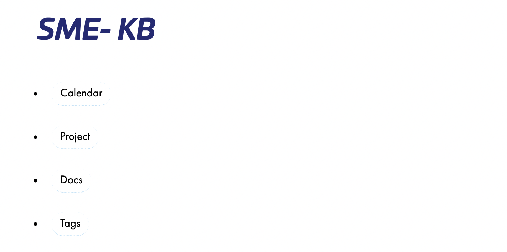

## SME Project

A Hugo theme for the generation, organisation, and viewing of multi-project notes written in markdown.

## installation

Add this theme in your hugo project, and add this in your `config.toml` file.

*Example of config.toml file*

``` toml
baseURL = "https://kb.local.meyn.fr"
languageCode = "fr-fr"
title = "SME - KB"
enableEmoji = true
theme = "sme-project"

[taxonomies]
  project = "project"
  tags = "tags"
  categories = "categories"

[[params.menu]]
  name = "Calendar"
  url = "all/"

[[params.menu]]
  name = "Project"
  url = "project/"

[[params.menu]]
  name = "Docs"
  url = "org/"


  [[params.menu]]
    identifier = "tags"
    pre = ""
    post = ""
    name = "Tags"
    url = "/tags/"
    title = ""
    weight = 2
  [[params.menu]]
    identifier = "categories"
    pre = ""
    post = ""
    name = "Categories"
    url = "/categories/"
    title = ""
    weight = 3


# If you want the table of contents at the top of individual notes to index
# further levels of header (default H2) set this to a higher number
[markup]
  [markup.tableOfContents]
    endLevel = 2

[frontmatter]
  lastmod = ["lastmod", ":fileModTime", ":default"]
```

After installation, your site looklike that



# Usage 
This project is more usefull with some other project.

1. Binary note

   Script to create note with archetype and tags
   generate the correct file with tags in name
   the archetype use the format use in file name to replace element
 
 2. edit webservice
   
   Edit web service permit to use Ctrl-n shortcut to create note
   Edit web service permit to use edit button on webpage to directly edit note
